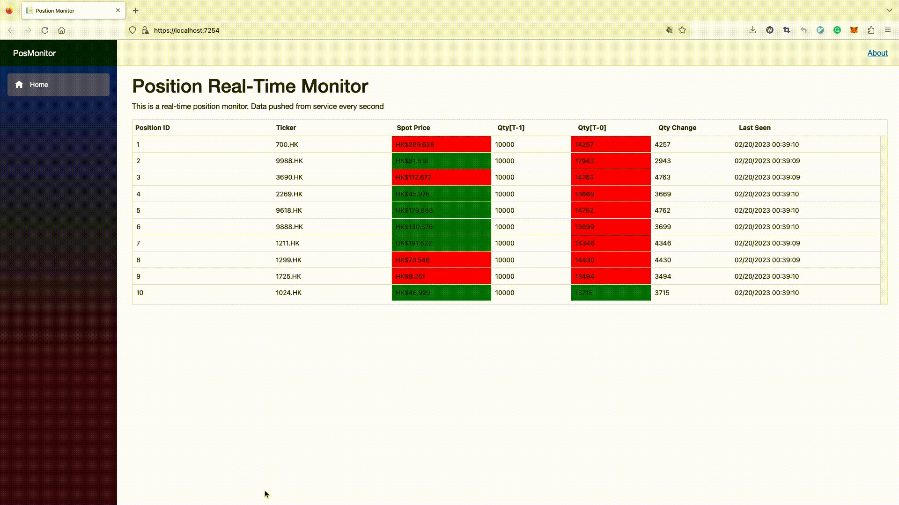

## Position Real-time Monitor
PosMonitor is a demo app monitoring real-time positions. It could publish data every second, and handle multiple connections concurrently. 

There are mainly two parts in this architecture,
- `PositionMonitor` is responsible for monitoring the positions and updating the snapshot everysecond. `PositionHub` is responsible for sending real-time data to all clients once it observes the updates from the monitor.

SignalR(Hub) framework is used here for real-time data publishing. 

